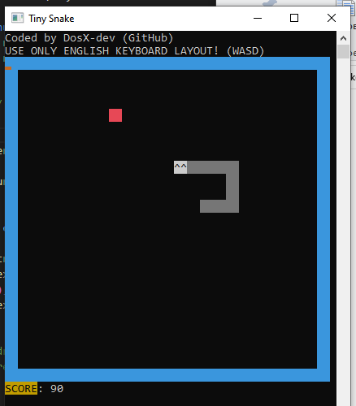

# TinySnake-game
Little game "Snake" for Windows in C (.EXE size is 3.5 kilobytes)

### [Download compiled as .EXE](https://github.com/DosX-dev/TinySnake-game/releases/tag/Builds)

### A little about the gameplay
 * The borders do not kill the snake, but teleport to the other side of the map
 * 10 points for each apple
 * Use the English keyboard layout to control
 * Don't resize the window during gameplay if you don't want to break the renderer
 * You have to enjoy the game

Enjoy! ;)

| Requirement | Minimum |
|---|---|
| Operating system | Windows 95
| Processor | Any 1 GHz CPU
| Memory | 1 mb
| Hard drive space | 4.5 kb free
